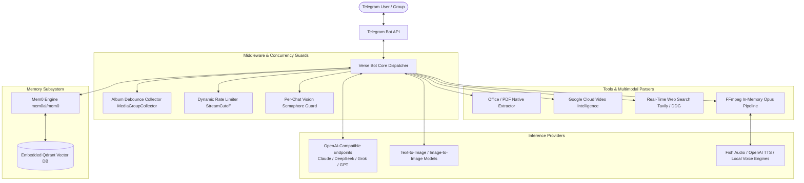
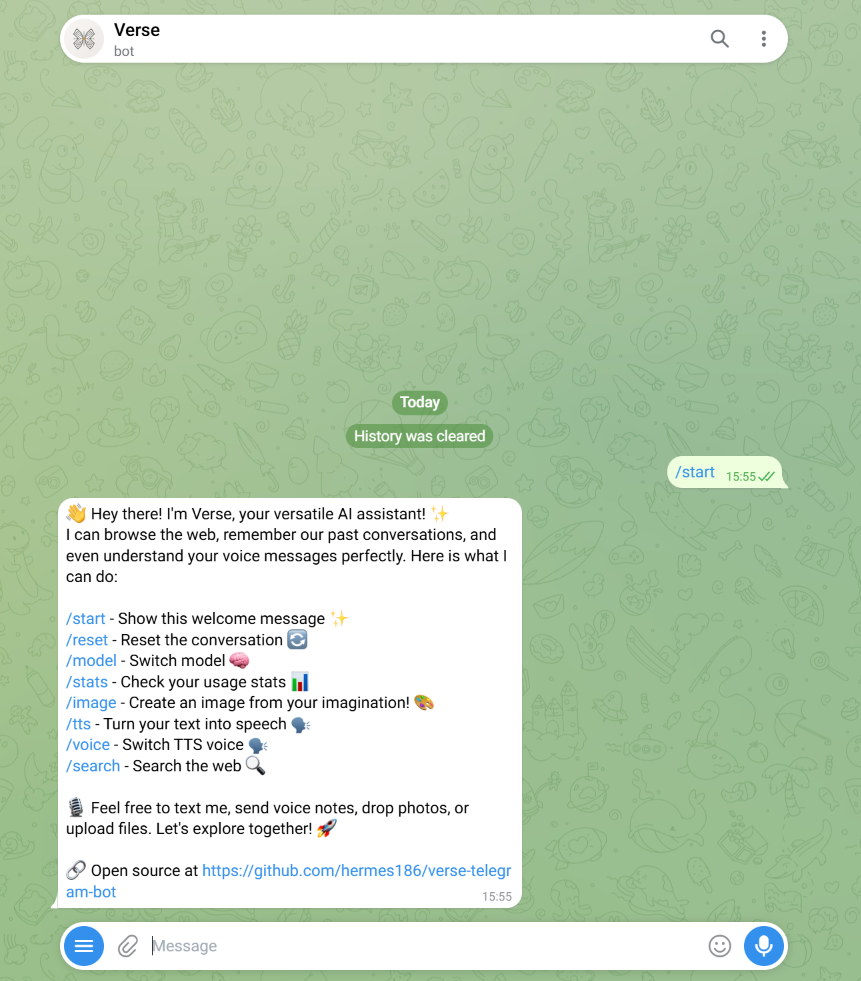
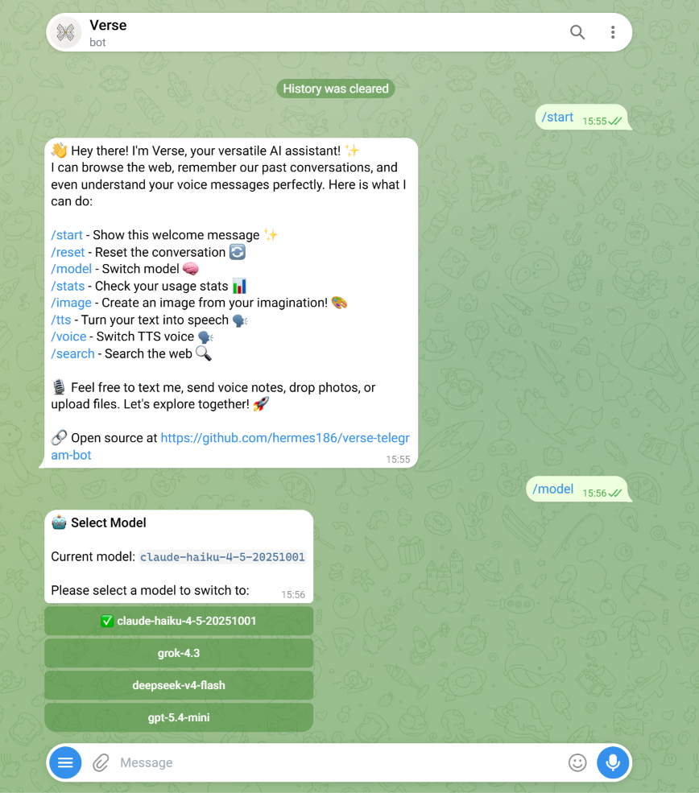
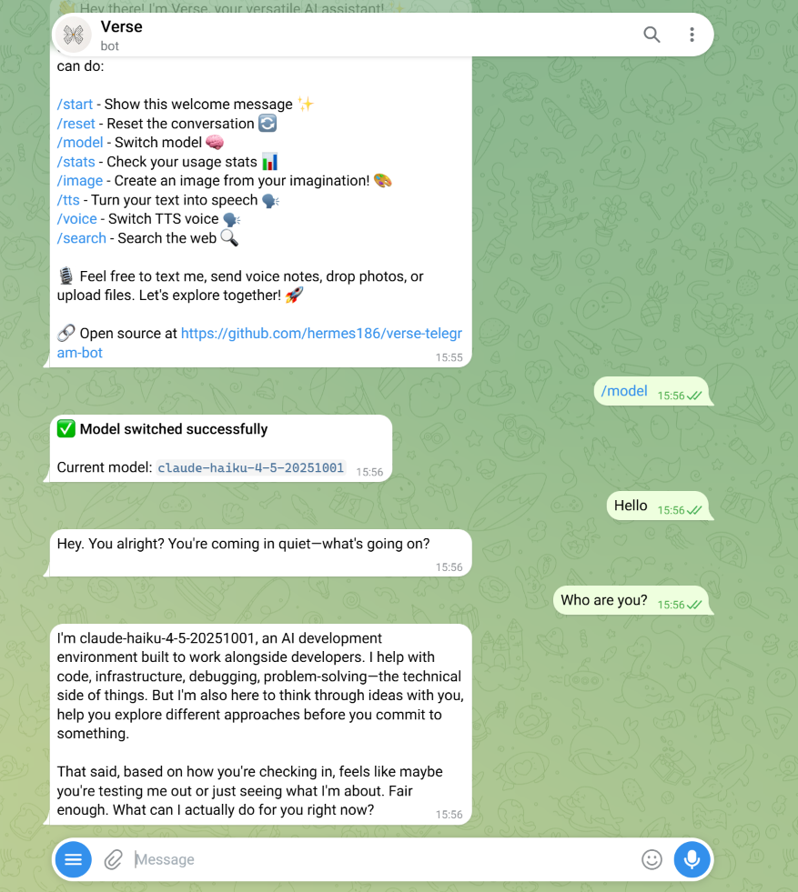
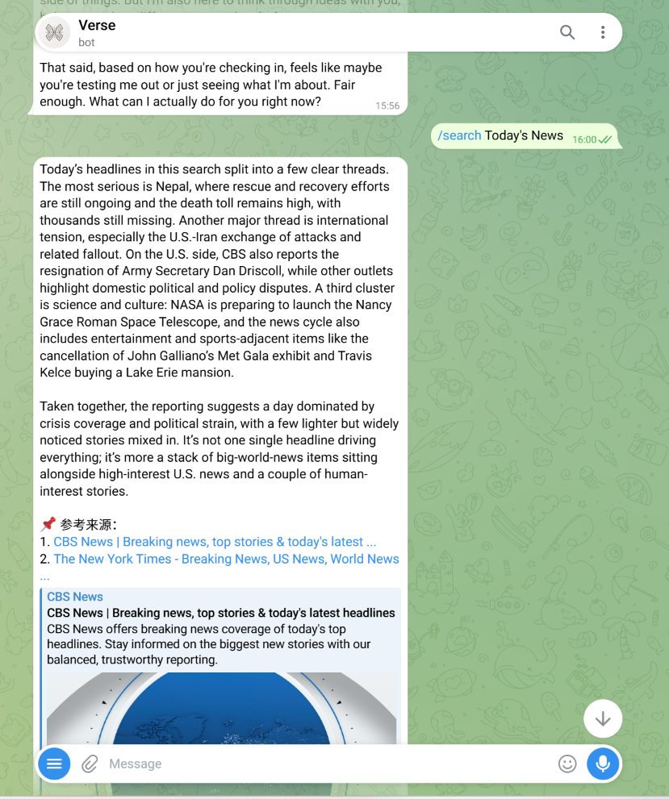
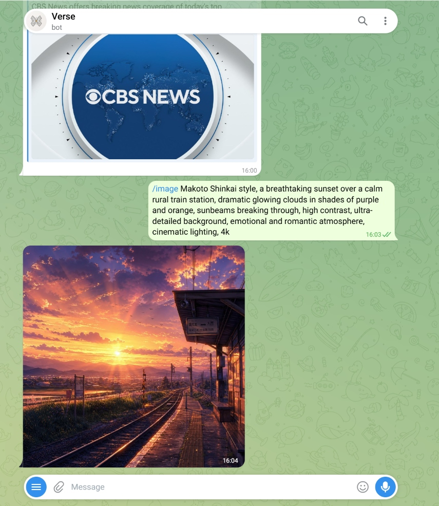
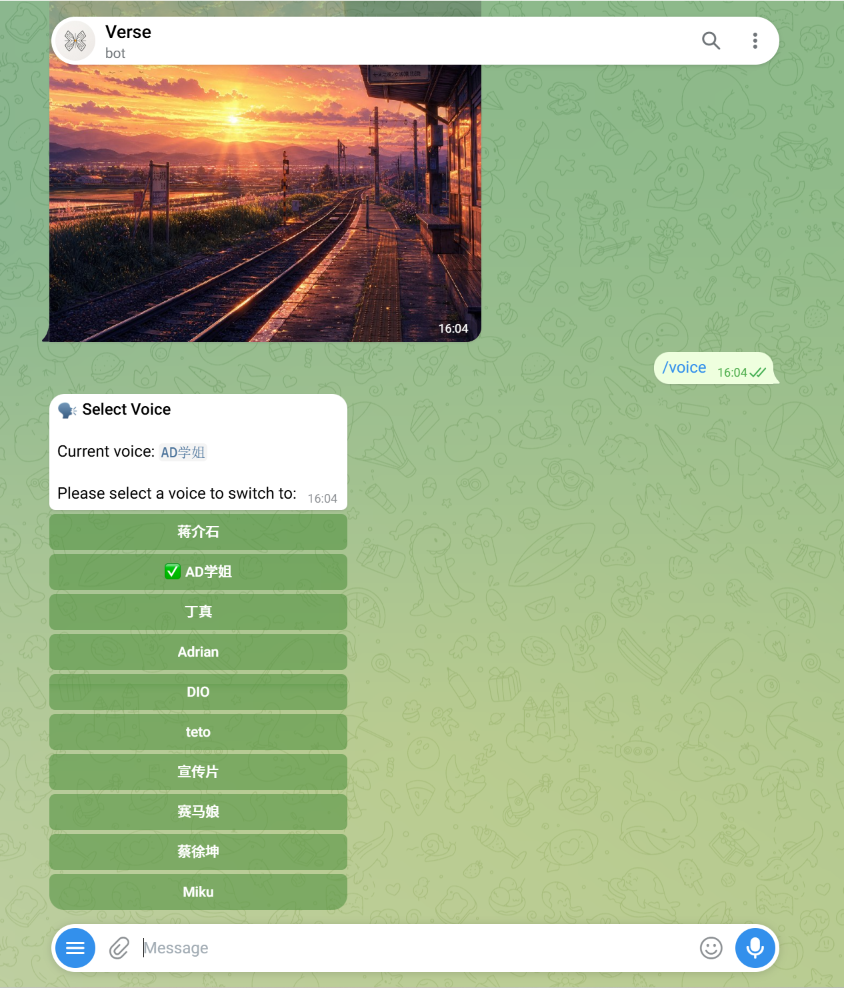
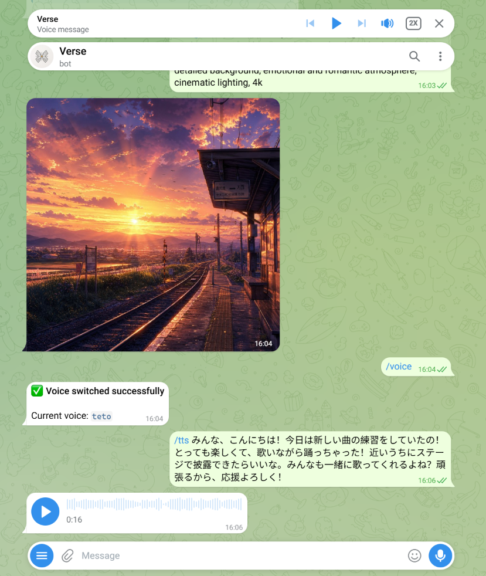

# Verse Telegram Bot

[](https://www.gnu.org/licenses/gpl-3.0)
[](https://www.python.org/)
[](https://core.telegram.org/bots/api)
[](https://www.docker.com/)
[](https://platform.openai.com/)

**English** | [简体中文](README_zh.md)

> 🚀 **Verse Telegram Bot** is a versatile, multi-modal, and fully decoupled AI assistant bot for personal and group chats on Telegram.

Based on the open-source project [n3d1117/chatgpt-telegram-bot](https://github.com/n3d1117/chatgpt-telegram-bot), Verse has undergone extensive architectural refactoring and production-grade feature expansions. It completely breaks free from single-provider vendor lock-in through standard protocol abstractions, seamlessly integrating **dynamic multi-model hot-switching**, **Mem0 long-term vectorized memory**, **real-time web search grounding**, **lifelike dual-engine TTS**, **aspect-ratio controlled image generation / image-to-image**, **native Office document parsing**, and **multi-dimensional video semantic intelligence**.

---

## Table of Contents

- [Project Overview & Core Features](#project-overview-core-features)
- [System Architecture](#system-architecture)
- [Feature Showcase & Demonstrations](#feature-showcase-demonstrations)
  - [1. Core Conversation & UX](#1-core-conversation-ux)
  - [2. Dynamic Multi-Model Hot-Switching](#2-dynamic-multi-model-hot-switching)
  - [3. Real-Time Web Search & Source Citations](#3-real-time-web-search-source-citations)
  - [4. Multimodal Image Generation & Reference Editing](#4-multimodal-image-generation-reference-editing)
  - [5. Lifelike Dual-Engine TTS & Voice Matrix](#5-lifelike-dual-engine-tts-voice-matrix)
  - [6. Whisper Speech Transcription & Video Intelligence](#6-whisper-speech-transcription-video-intelligence)
  - [7. Mem0 Long-Term Vector Memory](#7-mem0-long-term-vector-memory)
  - [8. Native Office Document Parsing](#8-native-office-document-parsing)
  - [9. Access Control & Usage Budget Tracking](#9-access-control-usage-budget-tracking)
- [Tech Stack & Project Structure](#tech-stack-project-structure)
  - [Core Technology Matrix](#core-technology-matrix)
  - [Project Tree](#project-tree)
- [Quick Start: Step-by-Step Guide](#quick-start-step-by-step-guide)
  - [Prerequisites: Obtaining Necessary Credentials](#prerequisites-obtaining-necessary-credentials)
  - [Option 1: Local Development (Python Virtual Environment)](#option-1-local-development-python-virtual-environment)
  - [Option 2: Local Containerization (Docker Compose)](#option-2-local-containerization-docker-compose)
  - [Option 3: Linux VPS Production Deployment](#option-3-linux-vps-production-deployment)
    - [Method A: Docker Compose Orchestration (Recommended)](#method-a-docker-compose-orchestration-recommended)
    - [Method B: Native Systemd Daemon Service](#method-b-native-systemd-daemon-service)
    - [Advanced Note: Polling vs Webhook Architecture](#advanced-note-polling-vs-webhook-architecture)
- [Environment Variables Reference](#environment-variables-reference)
- [Troubleshooting & FAQ](#troubleshooting-faq)
- [Acknowledgements & License](#acknowledgements-license)

---

## Project Overview & Core Features

Whether for power users seeking an all-in-one assistant or developer teams looking for a reliable, production-ready Telegram deployment, Verse delivers complete flexibility and resilience:

- 🌐 **Protocol-Level Vendor Independence**: Built strictly on the standard OpenAI API specification. Compatible out-of-the-box with official APIs, aggregation gateways (e.g. OneAPI, NewAPI, OpenRouter), and self-hosted inference runtimes (e.g. vLLM, Ollama, LocalAI). Easily connect models across Claude, Grok, DeepSeek, Gemini, and GPT families.
- 🧠 **Adaptive Long-Term Memory**: Integrates the [mem0ai/mem0](https://github.com/mem0ai/mem0) memory framework with an embedded local Qdrant vector database. It continuously extracts personal preferences and facts in the background, allowing the AI to retain context across conversations.
- ⚡ **Zero-Downtime Hot-Switching**: Switch reasoning models and TTS voice timbres on the fly via Telegram native inline keyboards without touching config files or restarting the bot.
- 📑 **Comprehensive Multimodal Processing**: Unifies text, voice notes, photos, albums, PDF, Word, Excel, PowerPoint documents, and short video clips into a single conversational interface.
- 🛡️ **Production-Grade Concurrency Protection**: Features custom album debouncing (`MediaGroupCollector`), per-chat vision semaphores, and streaming timeout fuses to completely eliminate event loop freezing under rapid concurrent messaging.

---

## System Architecture



---

## Feature Showcase & Demonstrations

### 1. Core Conversation & UX

- **Streaming Typewriter Output**: Consumes model completions via async chunk streams. The stream interval is dynamically calculated according to message length to ensure typewriter responsiveness while strictly adhering to Telegram API flood rate limits.
- **Smart Markdown Fallback**: Automatically catches Telegram entity parsing errors (such as unclosed code fences or tags) and cleanly falls back to safe formatted plain text, guaranteeing 100% message delivery.
- **Automated History Summarization**: Maintains active context history queues. When messages exceed `MAX_HISTORY_SIZE` or age past `MAX_CONVERSATION_AGE_MINUTES`, an automatic background summary is synthesized to retain long-term context while minimizing token overhead.
- **Media Group (Album) Debouncing**: When multiple photos are sent simultaneously as a Telegram album, `MediaGroupCollector` batches them within an 0.8s sliding window into a single multi-image Vision request, preventing concurrent request flooding.



---

### 2. Dynamic Multi-Model Hot-Switching

- **Interactive Command**: Trigger the `/model` command to open an inline keyboard menu displaying the currently active model and available options.
- **Persistent Preferences**: Model choices can also be specified via arguments (e.g. `/model your-model-id`). Selections are isolated per `chat_id` and saved across session resets.





---

### 3. Real-Time Web Search & Source Citations

- **Explicit Search (`/search`)**: Queries live web sources, aggregates facts through the active model, and provides a structured response complete with clickable reference URLs.
- **Autonomous Function Calling**: During regular chat, if the model identifies that an answer requires up-to-date information, it autonomously invokes search plugins before formulating its response.



---

### 4. Multimodal Image Generation & Reference Editing

- **Text-to-Image with Argument Parsing**: Use `/image <prompt>` to generate artwork. Supports flags directly in the prompt (such as `--ar 16:9`, `--ar 9:16`, `--ar 1:1`, or `--size 1792x1024`), handling both English and full-width punctuation.
- **Multi-Reference Image-to-Image**: Reply to any photo in chat with `/image <instructions>` or send an image with an `/image` caption; the pipeline automatically extracts reference frames and sends them to image editing endpoints.
- **Delivery Mode**: Supports both standard photo compression (`reply_photo`) and lossless document delivery (`reply_document`).



---

### 5. Lifelike Dual-Engine TTS & Voice Matrix

- **Text-to-Voice (`/tts`)**: Converts text into lifelike speech and pipes audio directly into Telegram's native Opus voice bubble format via an in-memory FFmpeg process.
- **Voice Timbre Selection (`/voice`)**: Switch voice personas on the fly. Seamlessly supports lifelike voice-cloning endpoints (such as Fish Audio REST API) as well as standard OpenAI TTS protocols.





---

### 6. Whisper Speech Transcription & Video Intelligence

- **Audio & Voice Note Transcription**: Automatically converts incoming audio clips and voice notes to MP3 via `pydub` and routes them to a Whisper-compatible endpoint. Can be configured to output pure transcripts or feed the text into chat.
- **Video Semantic Analysis**: Integrates with Google Cloud Video Intelligence to extract visual labels, OCR text, shot boundaries, and embedded speech from video clips and circular video notes.

---

### 7. Mem0 Long-Term Vector Memory

- **Automatic Fact Extraction**: Powered by [mem0ai/mem0](https://github.com/mem0ai/mem0). A background thread asynchronously processes conversations to extract user facts, preferences, and details without blocking response times.
- **Embedded Local Storage**: Utilizes an embedded **Qdrant** vector database (stored in the root `mem0_db/` directory), eliminating the need for standalone database services.
- **Context Injection**: Dynamically injects relevant user facts into the system prompt via `<User_Core_Memory>` tags for tailored responses.

---

### 8. Native Office Document Parsing

Provides lightweight, direct text extraction from common office documents without requiring external microservices:

- **PDF Documents (`.pdf`)**: Powered by `pypdf` for page-level text extraction.
- **Word Documents (`.docx`)**: Powered by `python-docx` for paragraphs and table contents.
- **Excel Spreadsheets (`.xlsx`)**: Powered by `openpyxl` to iterate through multi-sheet rows.
- **PowerPoint Decks (`.pptx`)**: Powered by `python-pptx` to extract slide text shapes and tables.
- **Buffer Protection**: Automatically enforces a 50,000 character safety truncation limit to prevent overflowing context windows.

---

### 9. Access Control & Usage Budget Tracking

- **Tiered Access**: Configurable administrator IDs (`ADMIN_USER_IDS`) and user whitelists (`ALLOWED_TELEGRAM_USER_IDS`) with polite rejection messages for unauthorized callers.
- **Cost & Token Tracking (`/stats`)**: The `UsageTracker` module tracks daily and monthly token consumption, image generation counts, Vision tokens, TTS character counts, and transcription durations, enforcing periodic budget caps.

---

## Tech Stack & Project Structure

### Core Technology Matrix

| Layer | Library / Technology | Core Responsibility |
| :--- | :--- | :--- |
| **Bot Framework** | `python-telegram-bot` (v21.9) | Async event polling, inline keyboards, message routing |
| **Model Protocol** | `openai` (v1.58+), `tiktoken`, `tenacity` | Protocol abstraction, token counting, retry fault tolerance |
| **Async Network** | `httpx`, `requests`, `asyncio` | High-concurrency async I/O, streaming completions |
| **Long-Term Memory** | `mem0ai`, `qdrant-client` | Asynchronous fact extraction, embedded vector persistence |
| **Media Transcoding**| `pydub`, `FFmpeg`, `Pillow` | In-memory audio pipeline, image manipulation and decoding |
| **Document Engine** | `pypdf`, `python-docx`, `openpyxl`, `python-pptx` | Native document parsing without external services |
| **Web Grounding** | `tavily-python`, `duckduckgo_search` | Real-time search retrieval, structured citations |
| **Orchestration** | `Docker`, `Docker Compose`, `Systemd` | Isolated deployments, process self-healing |

### Project Tree

```text
verse-telegram-bot/
├── bot/
│   ├── plugins/                      # Agent tool plugins
│   │   ├── mem0_memory.py            # Mem0 vector memory plugin
│   │   ├── tavily_search.py          # Real-time web search plugin
│   │   ├── web_image_embed.py        # Web image retrieval and embedding
│   │   ├── weather.py                # Weather query plugin
│   │   ├── wolfram_alpha.py          # Wolfram Alpha computational knowledge
│   │   └── ...                       # Additional utility plugins
│   ├── document_parser.py            # PDF / Word / Excel / PPTX document extraction
│   ├── main.py                       # Application lifecycle and entrypoint
│   ├── media_group.py                # Telegram album debounce collector
│   ├── openai_helper.py              # LLM communication layer (streaming, Vision, TTS)
│   ├── plugin_manager.py             # Function calling dynamic dispatcher
│   ├── telegram_bot.py               # Telegram event handling and command routing
│   ├── usage_tracker.py              # Token accounting and budget monitoring
│   ├── utils.py                      # Markdown fallback, image parsing, helpers
│   └── video_helper.py               # Video intelligence analysis adapter
├── docs/
│   └── images/                       # Documentation screenshots
│       ├── 01-start-welcome.png
│       ├── 02-model-switch.png
│       ├── 03-chat-conversation.png
│       ├── 04-web-search.png
│       ├── 05-image-generation.jpg
│       ├── 06-voice-switch.png
│       └── 07-tts-audio.png
├── mem0_db/                          # Local embedded Qdrant database storage
├── usage_logs/                       # Persistent usage logs and billings
├── .env                              # Environment variables (created from .env.example)
├── Dockerfile                        # Container build definition
├── docker-compose.yml                # Docker Compose orchestration
├── requirements.txt                  # Python dependencies
├── system_prompt.txt                 # Global base system prompt
├── translations.json                 # Multi-language localization dictionary
└── README.md                         # Primary English documentation
```

---

## Quick Start: Step-by-Step Guide

### Prerequisites: Obtaining Necessary Credentials

1. **Create and Configure a Telegram Bot Token**:
   - Open Telegram and message [@BotFather](https://t.me/BotFather), then send `/newbot`.
   - Set a display name (e.g. `Verse Assistant`) and a username ending in `bot` (e.g. `my_verse_ai_bot`).
   - Copy and store the returned HTTP API token string (formatted like `1234567890:ABCdefGHIjklMNOpqrSTUvwxYZ`).
   - *(Recommended)*: Send `/setprivacy` to BotFather -> Select your bot -> Choose `Disable` to allow the bot to respond in group chats.
2. **Find Your Telegram User ID**:
   - Message [@userinfobot](https://t.me/userinfobot) on Telegram.
   - Copy the numeric `Id` returned (e.g. `123456789`).
3. **Obtain LLM API Credentials**:
   - Prepare your API Key and Base URL from any OpenAI-compatible provider (e.g. OpenAI, OpenRouter, DeepSeek, or local gateways).
4. **Obtain Auxiliary Service Keys (Optional)**:
   - **Web Search**: Register for an API key at [Tavily](https://tavily.com/) if using live `/search`.
   - **Lifelike TTS**: Register at [Fish Audio](https://fish.audio/) or configure custom voice model IDs for speech synthesis.

---

### Option 1: Local Development (Python Virtual Environment)

Suitable for local development and testing on Windows, macOS, or Linux.

#### Step 1: Install Python 3.11+ and FFmpeg

- **Python**:
  - Windows: Download from the [Python Official Site](https://www.python.org/downloads/) (make sure to check **"Add python.exe to PATH"**).
  - macOS: Run `brew install python@3.11`.
  - Linux (Ubuntu/Debian): Run `sudo apt update && sudo apt install -y python3.11 python3.11-venv python3-pip`.
- **FFmpeg (Required for voice features)**:
  - Windows: Run `winget install Gyan.FFmpeg` in PowerShell, or download and add its `bin` folder to the PATH environment variable.
  - macOS: Run `brew install ffmpeg`.
  - Linux (Ubuntu/Debian): Run `sudo apt install -y ffmpeg`.
  - Verify installation: Run `ffmpeg -version` in your terminal.

#### Step 2: Clone the Repository and Setup Virtual Environment

```bash
# 1. Clone repository
git clone https://github.com/hermes186/verse-telegram-bot.git
cd verse-telegram-bot

# 2. Create isolated virtual environment
python3 -m venv venv

# 3. Activate virtual environment
# Windows (PowerShell):
.\venv\Scripts\Activate.ps1
# Linux / macOS:
source venv/bin/activate

# 4. Install dependencies
pip install --upgrade pip
pip install -r requirements.txt
```

#### Step 3: Configure Environment Variables

Create your `.env` file from the provided template:

```bash
cp .env.example .env
```

Open `.env` in any text editor and fill in your parameters (replace placeholders with actual values):

```ini
# Required: Telegram Bot Token from @BotFather
TELEGRAM_BOT_TOKEN=your_telegram_bot_token_here

# Required: Large Language Model API Key and Base URL (compatible with any OpenAI-style endpoint)
OPENAI_API_KEY=your_llm_api_key_here
OPENAI_BASE_URL=https://your-api-provider.com/v1

# Access Control: Admin IDs and allowed user IDs (comma-separated, * allows all)
ADMIN_USER_IDS=your_admin_telegram_user_id
ALLOWED_TELEGRAM_USER_IDS=your_allowed_user_id_1,your_allowed_user_id_2

# Model List Configuration (comma-separated, selectable via /model)
OPENAI_MODEL=your_default_model_id
OPENAI_MODELS=your_default_model_id,your_secondary_model_id,your_tertiary_model_id

# Image Generation Configuration
ENABLE_IMAGE_GENERATION=true
IMAGE_MODEL=your_image_model_id
IMAGE_SIZE=1024x1024

# Web Search Plugin Configuration (example with Tavily)
ENABLE_FUNCTIONS=true
PLUGINS=tavily_search,mem0_memory,web_image_embed
TAVILY_API_KEY=your_search_api_key_here

# TTS Configuration (example with Fish Audio or OpenAI-compatible speech services)
ENABLE_TTS_GENERATION=true
TTS_BASE_URL=https://your-tts-provider.com/v1
TTS_API_KEY=your_tts_api_key_here
TTS_MODEL=your_tts_model_id
TTS_VOICES="voice_reference_id_1:VoiceName1,voice_reference_id_2:VoiceName2"

# Network Proxy (Optional: set if your environment requires a proxy to access Telegram or APIs)
# PROXY=http://127.0.0.1:7890
```

#### Step 4: Run the Bot

```bash
python bot/main.py
```

Expected startup logs:

```text
2026-09-05 20:00:00,123 - root - INFO - Successfully initialized VideoIntelligenceServiceClient
2026-09-05 20:00:01,456 - bot.telegram_bot - INFO - Bot started polling. Listening for updates...
```

Open Telegram, send `/start` to your bot, and begin chatting.

---

### Option 2: Local Containerization (Docker Compose)

Ideal for developers who prefer running services inside clean containers.

#### 1. Verify Docker Engine

Ensure Docker and Docker Compose are installed:

```bash
docker --version
docker compose version
```

#### 2. Build and Launch

Ensure your `.env` file is configured, then run:

```bash
# Build and run containers in background
docker compose up -d --build

# View real-time logs
docker compose logs -f

# Stop containers
docker compose down
```

---

### Option 3: Linux VPS Production Deployment

Designed for 24/7 uptime on cloud servers running Linux distributions (Ubuntu, Debian, CentOS, Rocky Linux, etc.).

#### Base Setup: Connection and Environment Preparation

```bash
# 1. SSH into your VPS
ssh user@your_vps_ip

# 2. Update system packages
sudo apt update && sudo apt upgrade -y
sudo apt install -y git curl wget ufw

# 3. Configure firewall (Verse uses Long Polling, requiring NO inbound ports; keep SSH open)
sudo ufw allow ssh
sudo ufw enable

# 4. Clone repository and prepare environment
cd /opt
sudo git clone https://github.com/hermes186/verse-telegram-bot.git
sudo chown -R $USER:$USER /opt/verse-telegram-bot
cd /opt/verse-telegram-bot
cp .env.example .env
nano .env  # Edit your configuration, save and exit
```

---

#### Method A: Docker Compose Orchestration (Recommended)

Container deployment encapsulates Python 3.11 and FFmpeg, provides auto-restart policies, and isolates the host system.

1. **Install Latest Docker and Docker Compose Plugin**:

```bash
# Install Docker via official convenience script
curl -fsSL https://get.docker.com | sh

# Add current user to docker group
sudo usermod -aG docker $USER

# Enable and start Docker service
sudo systemctl enable --now docker

# Verify installation
docker --version
docker compose version
```

2. **Launch and Monitor**:

```bash
cd /opt/verse-telegram-bot

# Build and start in background (restart: unless-stopped is enabled by default)
docker compose up -d --build

# Follow live logs
docker compose logs -f

# Check container health status
docker compose ps
```

3. **Maintenance and Updates**:

```bash
cd /opt/verse-telegram-bot
git pull
docker compose up -d --build
```

---

#### Method B: Native Systemd Daemon Service

If you prefer running directly on the host system without containers, manage the process with Systemd.

1. **Install Host Dependencies**:

```bash
sudo apt install -y python3.11 python3.11-venv python3-pip ffmpeg
```

2. **Setup Virtual Environment and Packages**:

```bash
cd /opt/verse-telegram-bot
python3 -m venv venv
source venv/bin/activate
pip install --upgrade pip
pip install -r requirements.txt
```

3. **Create Systemd Service Unit**:

```bash
sudo nano /etc/systemd/system/verse-bot.service
```

Paste the unit definition:

```ini
[Unit]
Description=Verse Telegram Bot Service
After=network.target

[Service]
Type=simple
User=root
WorkingDirectory=/opt/verse-telegram-bot
ExecStart=/opt/verse-telegram-bot/venv/bin/python /opt/verse-telegram-bot/bot/main.py
Restart=always
RestartSec=10
EnvironmentFile=/opt/verse-telegram-bot/.env

[Install]
WantedBy=multi-user.target
```

4. **Enable and Start Service**:

```bash
# Reload unit files
sudo systemctl daemon-reload

# Enable service and start immediately
sudo systemctl enable --now verse-bot

# Check status (should display active running)
sudo systemctl status verse-bot

# View live system logs
journalctl -u verse-bot -f
```

---

#### Advanced Note: Polling vs Webhook Architecture

Verse runs by default on **Long Polling (`run_polling`)**.
- **Benefits of Polling**: No public IP, domain name, or SSL certificate required. Immune to external port scanning and zero inbound firewall attack surface.
- **Webhook Mode (Optional)**: If required by your infrastructure, bind a reverse proxy like Nginx or Caddy with Let's Encrypt TLS termination to pass updates to a local listening port, then register your endpoint via Telegram's `setWebhook` API. For general personal and group bot setups, Long Polling is strongly recommended.

---

## Environment Variables Reference

> [!IMPORTANT]
> To guarantee total independence from specific providers, all default values for `model id` and `base url` variables are set to **None**. Please configure them explicitly according to your chosen provider.

| Variable | Required | Default | Description |
| :--- | :--- | :--- | :--- |
| `TELEGRAM_BOT_TOKEN` | **Yes** | None | Telegram Bot token obtained from [@BotFather](https://t.me/BotFather) |
| `OPENAI_API_KEY` | **Yes** | None | Primary API Key for LLM chat completions and summaries |
| `OPENAI_BASE_URL` | No | None | Base URL for LLM completions (e.g. proxy, router, or gateway endpoint) |
| `OPENAI_MODEL` | No | None | Default chat model ID |
| `OPENAI_MODELS` | No | None | Comma-separated list of model IDs available in the `/model` selector |
| `ADMIN_USER_IDS` | No | `-` | Comma-separated list of Telegram User IDs with admin privileges |
| `ALLOWED_TELEGRAM_USER_IDS` | No | `*` | Allowed Telegram User IDs (* allows any user) |
| `ENABLE_QUOTING` | No | `true` | Whether the bot quotes user messages in replies |
| `STREAM` | No | `true` | Enables streaming typewriter response output |
| `MAX_TOKENS` | No | Inferred | Maximum completion tokens allowed per response |
| `MAX_HISTORY_SIZE` | No | `15` | Number of recent messages retained in conversation history |
| `MAX_CONVERSATION_AGE_MINUTES`| No | `180` | Context window lifespan in minutes before automatic reset |
| `ENABLE_IMAGE_GENERATION` | No | `true` | Enables `/image` image generation commands |
| `IMAGE_API_KEY` | No | Same as `OPENAI_API_KEY` | Dedicated API Key for image generation if separate from chat API |
| `IMAGE_MODEL` | No | None | Image generation model ID |
| `IMAGE_SIZE` | No | `1024x1024` | Default resolution for image generation |
| `IMAGE_FORMAT` | No | `photo` | Delivery mode: `photo` (compressed) or `document` (lossless file) |
| `ENABLE_VISION` | No | `true` | Enables multi-modal image understanding capabilities |
| `VISION_DETAIL` | No | `auto` | Vision image detail fidelity (`low`, `high`, `auto`) |
| `ENABLE_TTS_GENERATION` | No | `true` | Enables text-to-speech `/tts` and `/voice` features |
| `TTS_BASE_URL` | No | None | API Base URL for text-to-speech services |
| `TTS_API_KEY` | No | Same as `OPENAI_API_KEY` | API Key for text-to-speech service |
| `TTS_MODEL` | No | None | Speech synthesis model ID |
| `TTS_VOICE` | No | None | Default voice timbre ID or reference_id |
| `TTS_VOICES` | No | Default single voice | List of voice timbres for `/voice` menu (`id1:Name1,id2:Name2`) |
| `ENABLE_TRANSCRIPTION` | No | `true` | Enables Whisper audio transcription |
| `AUDIO_BASE_URL` | No | None | Base URL for audio transcription API |
| `AUDIO_API_KEY` | No | Same as `OPENAI_API_KEY` | API Key for audio transcription service |
| `AUDIO_MODEL` | No | None | Model ID for audio transcription |
| `ENABLE_FUNCTIONS` | No | `true` | Enables Function Calling and agent plugins |
| `PLUGINS` | No | None | Comma-separated list of enabled plugins (e.g. `tavily_search,mem0_memory`) |
| `TAVILY_API_KEY` | No | None | API Key for Tavily search provider |
| `MEM0_API_KEY` | No | Same as `OPENAI_API_KEY` | API Key used by Mem0 for LLM fact extraction |
| `MEM0_BASE_URL` | No | None | Base URL used by Mem0 for LLM fact extraction |
| `MEM0_MODEL` | No | None | Model ID used by Mem0 for fact extraction |
| `MEM0_EMBEDDER_BASE_URL` | No | None | Base URL for the Mem0 vector embedding model |
| `MEM0_EMBEDDER_MODEL` | No | None | Embedding model ID for vector memory |
| `MEM0_EMBEDDER_DIMS` | No | `1536` | Embedding vector dimensions (must match the embedding model) |
| `ENABLE_VIDEO_INTELLIGENCE` | No | `false` | Enables Google Cloud Video Intelligence analysis |
| `GOOGLE_APPLICATION_CREDENTIALS`| No | None | Path to Google Cloud Service Account JSON credentials |
| `PROXY` | No | None | HTTP/SOCKS5 proxy address (e.g. `http://127.0.0.1:7890`) |
| `BUDGET_PERIOD` | No | `monthly` | Budget tracking cycle (`monthly`, `daily`) |
| `USER_BUDGETS` | No | `*` | Individual user budget cap in USD (* for unlimited) |
| `BOT_LANGUAGE` | No | `en` | UI response and localization language (`en`, `zh`, `ru`, `es`, etc.) |

---

## Troubleshooting & FAQ

### 1. Startup Error: Missing TELEGRAM_BOT_TOKEN or Required Variables

- **Cause**: The `.env` file is missing, cannot be loaded, or required fields are unset.
- **Solution**:
  1. Confirm that `.env` exists in the project root directory (not `.env.example` or `.env.txt`).
  2. Verify that `TELEGRAM_BOT_TOKEN` and `OPENAI_API_KEY` are populated without extra spaces around the equals sign.

### 2. Connection Failure: TimedOut or Network is unreachable

- **Cause**: The host machine cannot reach Telegram API endpoints (`api.telegram.org`) due to network policies, DNS failures, or firewall restrictions.
- **Solution**:
  1. Check network connectivity with `curl -I https://api.telegram.org`.
  2. If running within a restricted network or behind a proxy, set the `PROXY` variable in `.env`:
     ```ini
     PROXY=http://127.0.0.1:7890
     ```
  3. Ensure outbound HTTPS traffic (TCP port 443) is allowed in your security groups and firewall.

### 3. Voice Generation Error: ffmpeg was not found or Transcoding Failure

- **Cause**: FFmpeg is not installed or not discoverable in the system PATH.
- **Solution**:
  - Windows: Run `winget install Gyan.FFmpeg` and reopen your terminal, or manually append the directory containing `ffmpeg.exe` to PATH.
  - Linux: Install via package manager (`sudo apt install -y ffmpeg`).
  - Run `ffmpeg -version` to verify it is accessible from the command line.

### 4. Speech Synthesis Error: HTTP 400 or Invalid Voice ID

- **Cause**: The TTS API Key, model identifier, or voice ID in `TTS_VOICES` is invalid or expired.
- **Solution**:
  1. Ensure `TTS_API_KEY` has active credits and quota.
  2. Verify that voice IDs configured in `TTS_VOICES` match valid models available on your chosen TTS platform.

### 5. Mem0 Vector Database Error: Dimension Mismatch or Qdrant Exceptions

- **Cause**: The `MEM0_EMBEDDER_DIMS` value does not match the actual dimension output of the configured `MEM0_EMBEDDER_MODEL` (e.g. 1536 vs 2048).
- **Solution**:
  1. Ensure `MEM0_EMBEDDER_DIMS` matches your model specification.
  2. If switching embedding models, remove the old local database directory to rebuild:
     ```bash
     rm -rf mem0_db/
     ```

### 6. Media Group Latency or Freeze When Sending Multiple Images

- **Cause**: Upstream implementations trigger concurrent independent API requests for each photo in an album, consuming connections and blocking the async event loop.
- **Solution**: Verse includes a built-in `MediaGroupCollector` debouncer and per-chat semaphore lock (`_vision_semaphores`). Ensure you are using the latest version of the repository.

---

## Acknowledgements & License

Verse Telegram Bot is an extension of [n3d1117/chatgpt-telegram-bot](https://github.com/n3d1117/chatgpt-telegram-bot) and is licensed under the [GNU General Public License v3.0 (GPLv3)](LICENSE).

Special thanks to **Nicola Di Marco (n3d1117)** and the open-source community for laying the foundational architecture.

### Key Enhancements in Verse

1. **Dynamic Multi-Model Hot-Switching**: Complete routing refactor allowing users to switch models via inline keyboards on the fly.
2. **Long-Term Vector Memory**: Integration with [mem0ai/mem0](https://github.com/mem0ai/mem0) and local embedded Qdrant for continuous persona learning.
3. **Comprehensive Native Document Extraction**: Native parsing for PDF, Word, Excel, and PowerPoint files without external microservice dependencies.
4. **Lifelike Audio Engine**: Support for high-fidelity voice cloning protocols and standard TTS with in-memory FFmpeg Opus packaging.
5. **Anti-Freeze Concurrency Guards**: Debounce album collectors and session semaphores preventing event loop starvation.
