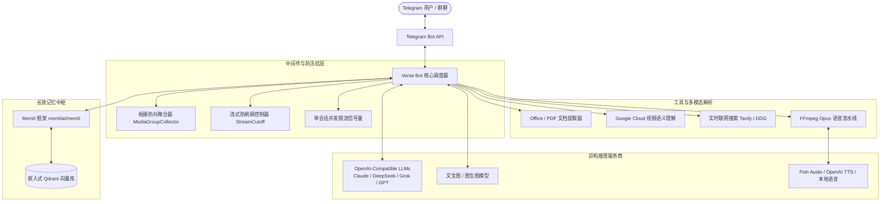

# Verse Telegram Bot

[](https://www.gnu.org/licenses/gpl-3.0)
[](https://www.python.org/)
[](https://core.telegram.org/bots/api)
[](https://www.docker.com/)
[](https://platform.openai.com/)

[English](README.md) | **简体中文**

> 🚀 **Verse Telegram Bot** 是一款面向全场景、多模态驱动且高度解耦的个人与群组 AI 助理机器人。

本项目基于开源项目 [n3d1117/chatgpt-telegram-bot](https://github.com/n3d1117/chatgpt-telegram-bot) 进行大规模深度重构与工业级扩展。项目摆脱了单一服务商的生态绑定，全面采用标准协议抽象，无缝融合**动态多模型热切换**、**Mem0 向量长期记忆中枢**、**实时联网搜索整合**、**高拟真人声双引擎 TTS**、**参数化文生图与图生图**、**Office 全格式文档提取**以及**视频多维语义分析**等前沿能力。

---

## 目录

- [项目概览与核心特性](#项目概览与核心特性)
- [系统架构概览](#系统架构概览)
- [核心功能详解与实机演示](#核心功能详解与实机演示)
  - [1. 基础对话与交互体验](#1-基础对话与交互体验)
  - [2. 多模型动态热切换](#2-多模型动态热切换)
  - [3. 实时联网搜索与资讯溯源](#3-实时联网搜索与资讯溯源)
  - [4. 多模态绘图与图生图扩展](#4-多模态绘图与图生图扩展)
  - [5. 双引擎 TTS 拟真语音合成与音色矩阵](#5-双引擎-tts-拟真语音合成与音色矩阵)
  - [6. Whisper 语音转写与视频多维理解](#6-whisper-语音转写与视频多维理解)
  - [7. Mem0 长期向量记忆中枢](#7-mem0-长期向量记忆中枢)
  - [8. Office 全格式文档即时解析](#8-office-全格式文档即时解析)
  - [9. 细粒度权限管控与用量计费](#9-细粒度权限管控与用量计费)
- [技术栈与工程结构](#技术栈与工程结构)
  - [核心技术矩阵](#核心技术矩阵)
  - [工程目录结构](#工程目录结构)
- [快速开始：分平台保姆级指南](#快速开始分平台保姆级指南)
  - [准备工作：获取必要凭证](#准备工作获取必要凭证)
  - [方案一：本地开发调试（Python 虚拟环境）](#方案一本地开发调试python-虚拟环境)
  - [方案二：本地容器化运行（Docker Compose）](#方案二本地容器化运行docker-compose)
  - [方案三：Linux VPS 服务器生产环境部署](#方案三linux-vps-服务器生产环境部署)
    - [方式 A: Docker Compose 容器化编排（生产推荐）](#方式-a-docker-compose-容器化编排生产推荐)
    - [方式 B: Systemd 守护进程原生运行](#方式-b-systemd-守护进程原生运行)
    - [进阶说明：Polling 与 Webhook 架构解析](#进阶说明polling-与-webhook-架构解析)
- [环境变量配置全景表](#环境变量配置全景表)
- [常见问题与故障排查](#常见问题与故障排查)
- [致谢与开源协议](#致谢与开源协议)

---

## 项目概览与核心特性

无论是追求极致体验的个人极客，还是需要搭建稳定高可用服务的开发者团队，Verse Telegram Bot 都提供了极高的自由度与可靠性：

- 🌐 **全开放协议生态**：底层全面遵循标准 OpenAI API 交互规范。不仅支持官方接口，亦可无缝对接各类聚合网关（如 OneAPI、NewAPI、OpenRouter）及私有化本地推理框架（如 vLLM、Ollama、LocalAI）。
- 🧠 **长效自适应记忆**：接入开源记忆框架 [mem0ai/mem0](https://github.com/mem0ai/mem0) 与本地轻量级嵌入式 Qdrant 向量库，跨会话自动提炼用户习惯与核心事实，让 AI 越聊越聪明。
- ⚡ **动态无感热切**：无需修改配置文件或重启进程，通过 Telegram 原生交互菜单即可按需热切换不同的大模型底座与语音音色。
- 📑 **全模态内容消化**：文本、语音、图片、相册、PDF、Word、Excel、PowerPoint 及视频等多媒体内容一站式理解，打破传统聊天机器人的输入壁垒。
- 🛡️ **生产级高并发防御**：独创相册消息防抖聚合（Debouncing）、单会话并发限流信号量与异步流式超时熔断机制，彻底解决并发风暴导致的进程冻结与卡死问题。

---

## 系统架构概览



---

## 核心功能详解与实机演示

### 1. 基础对话与交互体验

- **流式打字机响应（Streaming Output）**：通过异步流式读取后端生成内容，并根据消息长度自适应动态计算 Telegram 消息编辑间隔（Stream Cutoff），兼顾视觉打字机质感与 Telegram API 频率防护。
- **智能 Markdown 降级渲染**：自动拦截 Telegram 实体解析异常（如标签未闭合导致的消息投递失败），无损降级为格式化纯文本并二次重试，保障交付率 100%。
- **上下文自动压缩与管理**：会话维护队列窗口，当历史消息超出设定阈值或时间窗口时，自动触发轻量摘要压缩，兼顾超长对话连贯性与 Token 消耗控制。
- **相册（Album）防抖聚合**：针对 Telegram 分包发送的多图相册，基于 0.8 秒滑动窗口自动收拢为统一图像批次提交多模态大模型，杜绝多图引发的并发轰炸。


---

### 2. 多模型动态热切换

- **指令触发**：通过 `/model` 指令即刻呼出内联交互面板（Inline Keyboard）。
- **即时生效与记忆隔离**：支持可视化点击切换，亦可通过 `/model <model_id>` 快捷传参。不同聊天会话（Chat ID）的模型选择完全隔离并持久化，重启会话依然保持生效。


---

### 3. 实时联网搜索与资讯溯源

- **显式搜索指令（`/search`）**：调用深度搜索引擎抓取最新全网事实，交由模型进行智能信息重构，并在回答末尾格式化输出可点击的原始网页引用来源。
- **智能体自主调用（Function Calling）**：在普通聊天中，若模型判断当前问题依赖时效性信息，可自主激活联网工具并在获取背景后合成回复。


---

### 4. 多模态绘图与图生图扩展

- **文生图与参数解析**：使用 `/image <提示词>` 召唤绘图模型。原生支持在 Prompt 后追加控制参数（如 `--ar 16:9`、`--ar 9:16`、`--ar 1:1` 或 `--size 1792x1024`），兼容中英文全半角标点。
- **多参考图与图生图（Multi-Reference）**：直接回复群内或私聊中的图片并输入 `/image <修改要求>`，系统自动提取源图特征注入绘图管线，执行迁移变换。
- **分发格式适配**：支持配置为压缩图片（`reply_photo`）或原始无损文档（`reply_document`）。


---

### 5. 双引擎 TTS 拟真语音合成与音色矩阵

- **文本转原生语音（`/tts`）**：将指定文本合成为真实人声，并借助本地 FFmpeg 内存管道实时压制为 Telegram 原生标准 `libopus` 48kbps VBR OGG 语音便签。
- **多音色矩阵（`/voice`）**：支持热切换音色身份，深度兼容拟真人声克隆协议（以 Fish Audio 为例）及 OpenAI 标准通用语音协议。


---

### 6. Whisper 语音转写与视频多维理解

- **语音识别转写**：发送任何语音便签或音频片段，机器人通过音频解码器无缝中转至 Whisper 兼容模型，支持纯转写模式或“转写后直接问答”模式。
- **视频智能理解**：支持接入 Google Cloud Video Intelligence，对传入的短视频或视频圆球提取画面标签、OCR 文本检测、镜头切分与内嵌音轨转写，交由大模型输出多维分析。

---

### 7. Mem0 长期向量记忆中枢

- **自适应记忆提取**：集成开源项目 [mem0ai/mem0](https://github.com/mem0ai/mem0)，在不打断用户交互的前提下，利用后台非阻塞线程自动提炼对话中的核心事实与用户偏好。
- **嵌入式本地存储**：数据全量持久化在本地轻量级 **Qdrant** 向量库（位于根目录 `mem0_db/`），无需单独搭建外部集群。
- **动态注入提示词**：每次对话构建上下文时，检索与当前用户相关的核心记忆，通过 `<User_Core_Memory>` 标签安全注入 System Prompt。

---

### 8. Office 全格式文档即时解析

无需复杂的第三方文档转换微服务，纯原生 Python 流水线完成格式解析与文本抽取：

- **PDF 文档（`.pdf`）**：基于 `pypdf` 进行跨页文本与版面内容提取。
- **Word 文档（`.docx`）**：基于 `python-docx` 提取段落大纲与表格内容。
- **Excel 表格（`.xlsx`）**：基于 `openpyxl` 遍历多工作表行数据并格式化输出。
- **PowerPoint 演示文稿（`.pptx`）**：基于 `python-pptx` 逐页解析幻灯片内文本框与图形表格。
- **安全防护**：内置 50,000 字符智能截断机制，避免超长内容超出大模型上下文硬限制。

---

### 9. 细粒度权限管控与用量计费

- **用户鉴权分层**：支持配置系统超级管理员（`ADMIN_USER_IDS`）与授权用户白名单（`ALLOWED_TELEGRAM_USER_IDS`），对未授权访问给予友好拦截。
- **多维度用量追踪（`/stats`）**：内置 `UsageTracker` 模块，按天与按月精准统计文本 Token、图像生成数、Vision Token、TTS 字符数及转写时长，配合配额策略防止 API 被意外超额消耗。

---

## 技术栈与工程结构

### 核心技术矩阵

| 架构层级 | 核心库 / 技术选型 | 关键职责说明 |
| :--- | :--- | :--- |
| **通信调度** | `python-telegram-bot` (v21.9) | 异步事件轮询、内联键盘交互、群聊会话分发 |
| **模型集成** | `openai` (v1.58+)、`tiktoken`、`tenacity` | OpenAI 协议抽象封装、Token 精准测算、重试容错 |
| **异步网络** | `httpx`、`requests`、`asyncio` | 高并发异步 I/O、流式数据传输、REST 交互 |
| **长期记忆** | `mem0ai`、`qdrant-client` | 事实自动提炼、本地嵌入式向量持久化 |
| **媒体转码** | `pydub`、`FFmpeg`、`Pillow` | 音频格式管道转码、图像动态压缩与解码 |
| **文档引擎** | `pypdf`、`python-docx`、`openpyxl`、`python-pptx` | 办公文档原生免服务解析与信息提取 |
| **联网搜索** | `tavily-python`、`duckduckgo_search` | 去噪网页数据检索与结构化引用格式化 |
| **容器编排** | `Docker`、`Docker Compose`、`Systemd` | 全环境一键部署、服务健康探测与自愈运行 |

### 工程目录结构

```text
verse-telegram-bot/
├── bot/
│   ├── plugins/                      # 智能体插件系统
│   │   ├── mem0_memory.py            # Mem0 长期向量记忆插件
│   │   ├── tavily_search.py          # 实时联网搜索插件（以 Tavily 为例）
│   │   ├── web_image_embed.py        # 网页图像检索与上下文嵌入
│   │   ├── weather.py                # 实时气象信息插件
│   │   ├── wolfram_alpha.py          # 科学计算与符号知识插件
│   │   └── ...                       # 其他扩展插件
│   ├── document_parser.py            # PDF / Word / Excel / PPTX 文档解析中枢
│   ├── main.py                       # 机器人生命周期管理与入口
│   ├── media_group.py                # Telegram 相册多图防抖聚合器
│   ├── openai_helper.py              # LLM 通信层（流式处理、Vision、TTS 接口封装）
│   ├── plugin_manager.py             # 函数调用（Function Calling）动态注册器
│   ├── telegram_bot.py               # Telegram 核心业务事件响应与指令路由
│   ├── usage_tracker.py              # 消费预算控制与 Token 用量统计
│   ├── utils.py                      # Markdown 容错、图像参数解析与系统工具
│   └── video_helper.py               # 视频智能分析接口模块
├── docs/
│   └── images/                       # 文档演示截图资源
│       ├── 01-start-welcome.png
│       ├── 02-model-switch.png
│       ├── 03-chat-conversation.png
│       ├── 04-web-search.png
│       ├── 05-image-generation.jpg
│       ├── 06-voice-switch.png
│       └── 07-tts-audio.png
├── mem0_db/                          # Qdrant 本地向量数据库持久化目录
├── usage_logs/                       # 统计账单持久化目录
├── .env                              # 环境变量配置文件（基于 .env.example 新建）
├── Dockerfile                        # 容器镜像构建规范文件
├── docker-compose.yml                # 容器编排服务定义
├── requirements.txt                  # Python 依赖清单
├── system_prompt.txt                 # 全局基础系统提示词
├── translations.json                 # 国际化语言资源字典
└── README.md                         # 项目主说明文档
```

---

## 快速开始：分平台保姆级指南

### 准备工作：获取必要凭证

1. **创建并获取 Telegram Bot Token**：
   - 在 Telegram 中与官方认证账号 [@BotFather](https://t.me/BotFather) 对话，发送 `/newbot`。
   - 依次设定机器人昵称（如 `Verse Assistant`）与用户名（必须以 `bot` 结尾，如 `my_verse_ai_bot`）。
   - 创建成功后保存给出的 Token 字符串（形如 `1234567890:ABCdefGHIjklMNOpqrSTUvwxYZ`）。
   - *(推荐设置)*：向 BotFather 发送 `/setprivacy` -> 选择该机器人 -> 设置为 `Disable`，便于在群组中自由唤醒。
2. **获取个人 Telegram User ID**：
   - 搜索并向 [@userinfobot](https://t.me/userinfobot) 发送任意消息。
   - 记录返回的纯数字 `Id`（用于管理员与白名单配置）。
3. **准备大语言模型 API 凭据**：
   - 准备好任意兼容 OpenAI 接口规范的服务密钥（`API Key`）及基础地址（`Base URL`）。
4. **准备可选扩展服务的 API 凭据（按需配置）**：
   - **联网搜索**：若需要使用 `/search` 实时检索，可前往相应搜索服务商（如 [Tavily](https://tavily.com/)）注册获取 API Key。
   - **拟真音色**：若需要使用角色声音克隆，可前往相应平台（如 [Fish Audio](https://fish.audio/)）获取 API Key 与音色模型 ID。

---

### 方案一：本地开发调试（Python 虚拟环境）

适合本地 Windows / macOS / Linux 开发者进行代码调试与特性验证。

#### 步骤 1：安装 Python 3.11+ 与 FFmpeg

- **Python**：
  - Windows：访问 [Python 官网](https://www.python.org/downloads/) 下载安装，注意勾选 **"Add python.exe to PATH"**。
  - macOS：执行 `brew install python@3.11`。
  - Linux (Ubuntu/Debian)：执行 `sudo apt update && sudo apt install -y python3.11 python3.11-venv python3-pip`。
- **FFmpeg（语音模块必需）**：
  - Windows：使用管理员权限打开 PowerShell 运行 `winget install Gyan.FFmpeg`，或前往官网下载解压并将 `bin` 路径追加至系统 PATH 环境变量。
  - macOS：执行 `brew install ffmpeg`。
  - Linux (Ubuntu/Debian)：执行 `sudo apt install -y ffmpeg`。
  - 验证命令：终端输入 `ffmpeg -version`，能正常输出版本号即为就绪。

#### 步骤 2：克隆代码与初始化虚拟环境

```bash
# 1. 克隆代码仓库
git clone https://github.com/hermes186/verse-telegram-bot.git
cd verse-telegram-bot

# 2. 创建独立虚拟运行环境
python3 -m venv venv

# 3. 激活虚拟环境
# Windows (PowerShell):
.\venv\Scripts\Activate.ps1
# Linux / macOS:
source venv/bin/activate

# 4. 安装依赖库
pip install --upgrade pip
pip install -r requirements.txt
```

#### 步骤 3：配置环境参数文件

在项目根目录根据模板创建 `.env` 文件：

```bash
cp .env.example .env
```

使用编辑器打开 `.env`，填入您的实际配置参数（将下方说明占位符替换为真实值）：

```ini
# 必填：Telegram 机器人 Token
TELEGRAM_BOT_TOKEN=your_telegram_bot_token_here

# 必填：大语言模型 API Key 与基础地址（兼容 OpenAI 规范的任何服务商或中转网关）
OPENAI_API_KEY=your_llm_api_key_here
OPENAI_BASE_URL=https://your-api-provider.com/v1

# 权限控制：管理员 ID 与白名单 ID 列表（逗号分隔，填 * 代表完全开放）
ADMIN_USER_IDS=your_admin_telegram_user_id
ALLOWED_TELEGRAM_USER_IDS=your_allowed_user_id_1,your_allowed_user_id_2

# 模型列表配置（以逗号分隔，用于在 Telegram 中通过 /model 指令自由切换）
OPENAI_MODEL=your_default_model_id
OPENAI_MODELS=your_default_model_id,your_secondary_model_id,your_tertiary_model_id

# 图像生成模型配置
ENABLE_IMAGE_GENERATION=true
IMAGE_MODEL=your_image_model_id
IMAGE_SIZE=1024x1024

# 联网搜索插件配置（以 Tavily 为例）
ENABLE_FUNCTIONS=true
PLUGINS=tavily_search,mem0_memory,web_image_embed
TAVILY_API_KEY=your_search_api_key_here

# TTS 语音合成服务配置（以兼容 OpenAI 协议或 Fish Audio 协议的音色服务为例）
ENABLE_TTS_GENERATION=true
TTS_BASE_URL=https://your-tts-provider.com/v1
TTS_API_KEY=your_tts_api_key_here
TTS_MODEL=your_tts_model_id
TTS_VOICES="voice_reference_id_1:音色名称1,voice_reference_id_2:音色名称2"

# 网络代理配置（可选：若运行环境需要通过代理访问 Telegram 或外部 API 则配置）
# PROXY=http://127.0.0.1:7890
```

#### 步骤 4：启动与验证

```bash
python bot/main.py
```

终端打印类似如下日志即代表启动成功，此时打开 Telegram 与机器人发送 `/start` 即可开启互动：

```text
2026-09-05 20:00:00,123 - root - INFO - Successfully initialized VideoIntelligenceServiceClient
2026-09-05 20:00:01,456 - bot.telegram_bot - INFO - Bot started polling. Listening for updates...
```

---

### 方案二：本地容器化运行（Docker Compose）

适合习惯使用 Docker 且希望依赖完全隔离的本地用户。

#### 1. 验证 Docker 环境

确保本地 Docker 引擎已启动：

```bash
docker --version
docker compose version
```

#### 2. 构建与运行容器

确保根目录下的 `.env` 文件已配置完毕后，执行启动命令：

```bash
# 后台构建并启动服务
docker compose up -d --build

# 查看实时运行日志
docker compose logs -f

# 停止容器服务
docker compose down
```

---

### 方案三：Linux VPS 服务器生产环境部署

适合在全球各类主流云服务商的 Linux 服务器（Ubuntu、Debian、CentOS、Rocky Linux、Arch Linux 等）上进行 7x24 小时全天候部署。

#### 基础准备：连接与环境初始化

```bash
# 1. 远程登录 VPS
ssh user@your_vps_ip

# 2. 更新系统包缓存并安装基础工具
sudo apt update && sudo apt upgrade -y
sudo apt install -y git curl wget ufw

# 3. 配置防火墙（由于机器人采用长轮询模式主动拉取消息，无需开放入站端口，只需放行 SSH 即可）
sudo ufw allow ssh
sudo ufw enable

# 4. 拉取代码并创建配置文件
cd /opt
sudo git clone https://github.com/hermes186/verse-telegram-bot.git
sudo chown -R $USER:$USER /opt/verse-telegram-bot
cd /opt/verse-telegram-bot
cp .env.example .env
nano .env  # 填入您的配置参数，保存退出
```

---

#### 方式 A: Docker Compose 容器化编排（生产推荐）

容器化方案自包含 Python 3.11 与 FFmpeg 运行环境，具备开机自启和故障自愈能力，是最推荐的部署方式。

1. **一键安装最新 Docker 与 Docker Compose 插件**：

```bash
# 使用 Docker 官方脚本快速安装
curl -fsSL https://get.docker.com | sh

# 赋予当前用户免 sudo 执行 Docker 权限
sudo usermod -aG docker $USER

# 激活并设置 Docker 开机自启
sudo systemctl enable --now docker

# 检查安装状态
docker --version
docker compose version
```

2. **启动与管理机器人服务**：

```bash
cd /opt/verse-telegram-bot

# 后台构建并启动（docker-compose.yml 中已预设 restart: unless-stopped）
docker compose up -d --build

# 跟踪查看运行日志
docker compose logs -f

# 查看当前容器运行状态
docker compose ps
```

3. **版本升级与日常维护**：

```bash
cd /opt/verse-telegram-bot
git pull
docker compose up -d --build
```

---

#### 方式 B: Systemd 守护进程原生运行

如果您偏好直接使用原生系统进程管理，可以使用 Systemd 托管。

1. **安装系统依赖**：

```bash
sudo apt install -y python3.11 python3.11-venv python3-pip ffmpeg
```

2. **创建运行虚拟环境并装载依赖**：

```bash
cd /opt/verse-telegram-bot
python3 -m venv venv
source venv/bin/activate
pip install --upgrade pip
pip install -r requirements.txt
```

3. **配置 Systemd 单元文件**：

```bash
sudo nano /etc/systemd/system/verse-bot.service
```

粘贴以下服务编排内容：

```ini
[Unit]
Description=Verse Telegram Bot Service
After=network.target

[Service]
Type=simple
User=root
WorkingDirectory=/opt/verse-telegram-bot
ExecStart=/opt/verse-telegram-bot/venv/bin/python /opt/verse-telegram-bot/bot/main.py
Restart=always
RestartSec=10
EnvironmentFile=/opt/verse-telegram-bot/.env

[Install]
WantedBy=multi-user.target
```

4. **激活并启用服务**：

```bash
# 重载系统单元配置
sudo systemctl daemon-reload

# 启动并设置开机自启
sudo systemctl enable --now verse-bot

# 检查状态（显示 active (running) 即代表成功）
sudo systemctl status verse-bot

# 实时查看输出日志
journalctl -u verse-bot -f
```

---

#### 进阶说明：Polling 与 Webhook 架构解析

本项目原生默认采用 **长轮询模式（Long Polling）**。
- **Polling 优点**：无需公网 IP、无需域名、无需配置 SSL 证书、无需处理外部探测和防火墙入站规则，运维成本极低且稳定性极强。
- **Webhook 模式（可选）**：如果您拥有独立公网 IP 与合规域名，且业务架构强制要求 Webhook，可使用 Nginx / Caddy 监听 443 端口，通过 Let's Encrypt 证书终结 TLS 后反向代理至本地应用，并调用 Telegram `setWebhook` 注册回调地址。对于绝大多数个人和群组场景，保持默认的 Polling 模式即可。

---

## 环境变量配置全景表

> [!IMPORTANT]
> 为保障极高的服务商接入自由度，所有涉及 `model id` 与 `base url` 的默认值均统一为 **无**，请开发者根据实际接入的端点与模型进行显式配置。

| 环境变量名 | 是否必填 | 默认值 | 用途与详细说明 |
| :--- | :--- | :--- | :--- |
| `TELEGRAM_BOT_TOKEN` | **是** | 无 | 从 [@BotFather](https://t.me/BotFather) 获取的 Telegram Bot 唯一鉴权 Token |
| `OPENAI_API_KEY` | **是** | 无 | 用于对话、上下文摘要的大语言模型 API 密钥 |
| `OPENAI_BASE_URL` | 否 | 无 | 大语言模型 API 接口基础地址（如对接第三方聚合网关时填写） |
| `OPENAI_MODEL` | 否 | 无 | 默认对话大模型 ID |
| `OPENAI_MODELS` | 否 | 无 | 允许用户在 `/model` 面板中自主切换的模型 ID 列表，以半角逗号分隔 |
| `ADMIN_USER_IDS` | 否 | `-` | 管理员 Telegram User ID 列表（半角逗号分隔），不受预算限制 |
| `ALLOWED_TELEGRAM_USER_IDS` | 否 | `*` | 允许访问机器人的用户 ID 白名单。填 `*` 表示对所有用户开放 |
| `ENABLE_QUOTING` | 否 | `true` | 是否在机器人回复时引用用户的原消息 |
| `STREAM` | 否 | `true` | 是否开启流式打字机逐字输出回复 |
| `MAX_TOKENS` | 否 | 依据模型推断 | 单次大模型回复允许生成的最大 Token 上限 |
| `MAX_HISTORY_SIZE` | 否 | `15` | 保留的单会话上下文历史消息条数 |
| `MAX_CONVERSATION_AGE_MINUTES`| 否 | `180` | 会话记忆保持活跃的最长时间（分钟），超时后自动重置上下文 |
| `ENABLE_IMAGE_GENERATION` | 否 | `true` | 是否启用 `/image` 图像生成指令 |
| `IMAGE_API_KEY` | 否 | 同 `OPENAI_API_KEY` | 绘图接口专用的 API Key（若绘图使用独立中转通道） |
| `IMAGE_MODEL` | 否 | 无 | 绘图模型 ID |
| `IMAGE_SIZE` | 否 | `1024x1024` | 默认生成图像分辨率 |
| `IMAGE_FORMAT` | 否 | `photo` | 图片下发方式：`photo` 为压缩图预览，`document` 为无损原图文件 |
| `ENABLE_VISION` | 否 | `true` | 是否启用图像多模态语义理解能力 |
| `VISION_DETAIL` | 否 | `auto` | 图像送入 Vision 模型的清晰度参数（`low`, `high`, `auto`） |
| `ENABLE_TTS_GENERATION` | 否 | `true` | 是否启用 `/tts` 与 `/voice` 语音合成功能 |
| `TTS_BASE_URL` | 否 | 无 | TTS 服务的 API 请求基地址 |
| `TTS_API_KEY` | 否 | 同 `OPENAI_API_KEY` | TTS 服务的专属鉴权密钥 |
| `TTS_MODEL` | 否 | 无 | TTS 模型 ID |
| `TTS_VOICE` | 否 | 无 | 默认 TTS 音色 ID 或 reference_id |
| `TTS_VOICES` | 否 | 默认单一音色 | `/voice` 切换菜单的音色字典列表，格式为 `"id1:名称1,id2:名称2"` |
| `ENABLE_TRANSCRIPTION` | 否 | `true` | 是否启用 Whisper 语音便签自动识别转写 |
| `AUDIO_BASE_URL` | 否 | 无 | 语音转写服务的基础接口地址 |
| `AUDIO_API_KEY` | 否 | 同 `OPENAI_API_KEY` | 语音转写服务的专属 API Key |
| `AUDIO_MODEL` | 否 | 无 | 语音转写模型 ID |
| `ENABLE_FUNCTIONS` | 否 | `true` | 是否开启 Function Calling（函数调用与智能体插件） |
| `PLUGINS` | 否 | 无 | 启用的功能插件列表，如 `tavily_search,mem0_memory,web_image_embed` |
| `TAVILY_API_KEY` | 否 | 无 | 联网搜索服务鉴权 Key，启用搜索插件时必填 |
| `MEM0_API_KEY` | 否 | 同 `OPENAI_API_KEY` | Mem0 提取长期记忆事实使用的 LLM API Key |
| `MEM0_BASE_URL` | 否 | 无 | Mem0 提取记忆事实调用的接口地址 |
| `MEM0_MODEL` | 否 | 无 | Mem0 用于提炼事实的推理模型 ID |
| `MEM0_EMBEDDER_BASE_URL` | 否 | 无 | Mem0 向量嵌入模型（Embedding）的接口地址 |
| `MEM0_EMBEDDER_MODEL` | 否 | 无 | 向量嵌入模型 ID |
| `MEM0_EMBEDDER_DIMS` | 否 | `1536` | 向量嵌入维度大小（需与所用嵌入模型严格匹配） |
| `ENABLE_VIDEO_INTELLIGENCE` | 否 | `false` | 是否开启视频语义解析扩展 |
| `GOOGLE_APPLICATION_CREDENTIALS`| 否 | 无 | 服务账号私钥 JSON 凭据文件路径 |
| `PROXY` | 否 | 无 | HTTP/SOCKS5 代理地址（如 `http://127.0.0.1:7890`） |
| `BUDGET_PERIOD` | 否 | `monthly` | 额度计量周期（可选 `monthly`、`daily`） |
| `USER_BUDGETS` | 否 | `*` | 用户额度限制（美元），填 `*` 为不限制 |
| `BOT_LANGUAGE` | 否 | `en` | 交互界面与提示语语言，支持 `zh`, `en`, `ru`, `es` 等 |

---

## 常见问题与故障排查

### 1. 启动报错：缺少 TELEGRAM_BOT_TOKEN 等环境变量

- **原因**：项目未能读取到 `.env` 文件，或关键字段未配置。
- **排查方法**：
  1. 确认已在项目根目录下创建了 `.env` 文件（注意不是 `.env.example` 或带有扩展名的文本）。
  2. 确认文件中 `TELEGRAM_BOT_TOKEN` 和 `OPENAI_API_KEY` 已正确填充且等号两端无多余空格。

### 2. 无法连接 Telegram：报错 TimedOut 或 Network is unreachable

- **原因**：当前网络环境无法直连 Telegram 官方 API 服务器（`api.telegram.org`）。
- **排查方法**：
  1. 验证基础网络连通性：在宿主机终端执行 `curl -I https://api.telegram.org`，检查能否收到 HTTP 响应。
  2. 若运行于特定受限网络中，请在 `.env` 中配置代理参数：
     ```ini
     PROXY=http://127.0.0.1:7890
     ```
  3. 检查系统安全组或出站防火墙规则，确保放行 TCP 443 端口的访问请求。

### 3. 调用语音功能报错：ffmpeg was not found 或转码异常

- **原因**：系统未正确安装 FFmpeg 组件，导致音频流无法在内存中进行 Opus 编码。
- **排查方法**：
  - Windows：确认执行了 `winget install Gyan.FFmpeg` 并重启终端，或手动将 `ffmpeg.exe` 所在目录加入环境变量 PATH。
  - Linux：通过系统包管理器安装，如 `sudo apt update && sudo apt install -y ffmpeg`。
  - 执行 `ffmpeg -version` 确认终端可正常调用。

### 4. 语音合成失败：报错 HTTP 400 或音色不存在

- **原因**：TTS 服务的鉴权密钥失效、模型名不匹配或音色 ID 错误。
- **排查方法**：
  1. 检查 `TTS_API_KEY` 是否有效且具有充足用量额度。
  2. 确认 `TTS_VOICES` 中配置的音色 ID 在目标 TTS 平台上真实存在且当前用户具备调用权限。

### 5. Mem0 向量数据库报错：Dimension mismatch 或 qdrant 报错

- **原因**：`MEM0_EMBEDDER_DIMS` 设置的维度与所选用的 `MEM0_EMBEDDER_MODEL` 实际输出向量维度不一致（例如模型输出为 1536 维，但配置填成了 2048 维）。
- **排查方法**：
  1. 确认配置参数与所用向量模型的维度严格对应。
  2. 若中途更换过 Embedding 模型，删除原有本地向量缓存重建即可：
     ```bash
     rm -rf mem0_db/
     ```

### 6. 发送多张图片时机器人反应缓慢或卡死

- **原因**：上游原始项目在用户发送多图相册时，为每张图分别发起并发请求，瞬时耗尽并发连接并导致 Telegram 事件循环被阻塞。
- **优化说明**：Verse 项目已自研引入 `MediaGroupCollector` 防抖聚合器与单会话并发限流信号量（`_vision_semaphores`）。请确保使用 Verse 最新主分支代码，该问题已被彻底修复。

---

## 致谢与开源协议

本项目基于开源项目 [n3d1117/chatgpt-telegram-bot](https://github.com/n3d1117/chatgpt-telegram-bot) 进行二次开发与架构扩展，遵循 [GNU General Public License v3.0 (GPLv3)](LICENSE) 开源协议。

感谢原作者 **Nicola Di Marco (n3d1117)** 及社区贡献者构建的坚实底座。

### 本项目核心升级路线一览

1. **多模型热切换架构**：重构模型调度体系，支持在 Telegram 客户端内秒级动态切换异构大语言模型。
2. **长效向量记忆系统**：接入 [mem0ai/mem0](https://github.com/mem0ai/mem0) 与本地嵌入式 Qdrant 向量库，赋能机器人长期事实提炼能力。
3. **多模态与文档全格式支持**：增加 Office（PDF、Word、Excel、PPTX）原生解析引擎与 Google Cloud 视频智能语义理解。
4. **音频引擎与高拟真人声**：支持自定义高拟真音色协议与通用语音协议，打通 FFmpeg 内存管道无缝封装 Opus 原生语音便签。
5. **企业级防并发卡死设计**：首创相册防抖收集聚合器与会话级信号量保护锁，彻底根除多图并发卡死隐患。
